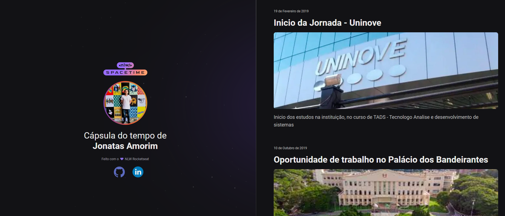

# 🕐 Time_Capsule - NLW Spacetime Rocketseat 🖥

  

## 🖥 Projeto
Esse é um projeto Web Responsivo de uma cápsula do tempo para exibir memórias em uma linha do tempo.

## 🗽 Tecnologias
Esse projeto foi desenvolvido durante o NLW da Rocketseat com as seguintes tecnologias:

- HTML
- CSS 
- Git / Github

## 🏷 Layout
Você pode visualizar o layout do projeto através [desse link](https://www.figma.com/file/Hrl0KfCy7RC6KZcRK1XSYY/C%C3%A1psula-do-tempo-%E2%80%A2-Trilha-Explorer?type=design&node-id=306%3A3&t=Qx8eZjJ8LK1NI5xy-1). É necessário ter uma conta no [figma](https://www.figma.com).
